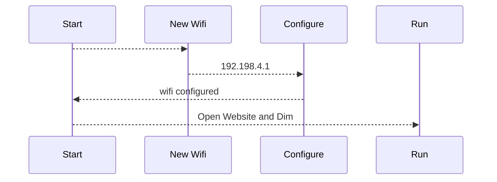
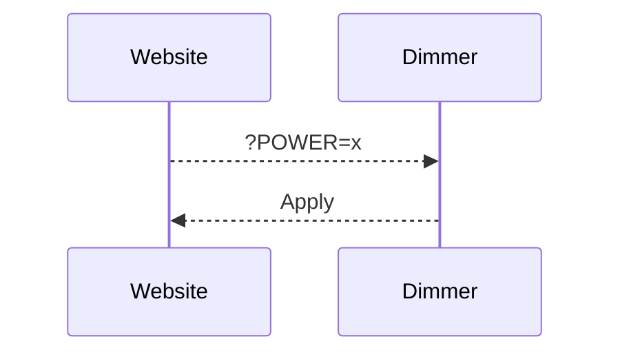

# # DIY IoT AC-Dimmer KIT, ESP8266 Wi-Fi D1 Mini for AC 110~240V dimming control.

This is a WORKING exemple of application with the AC-Dimmer KIT from Robotdyn... 
https://robotdyn.com/diy-iot-ac-dimmer-kit-esp8266-wi-fi-d1-mini-for-ac-110-240v-dimming-control.html

# Installation

make a git clone of the project and use Visual studio code for build and upload to the board. 
I made test with D5 and D6 but by default, D0 and D1 is used and solt on the board. 

# USE

at the first start, the wemos use the Wifimanager for configure the Wifi. 

# CHANGE POWER
for change power use the web site : 
Control :  http://IP/?POWER=xx
xx max = 99 

# note on Robotdyn librairie
with actual version of arduino GUI or VS, the librairie not working
I modify the librairie and is called in the lib_deps variable
lib_deps = https://github.com/xlyric/RBDDimmer

